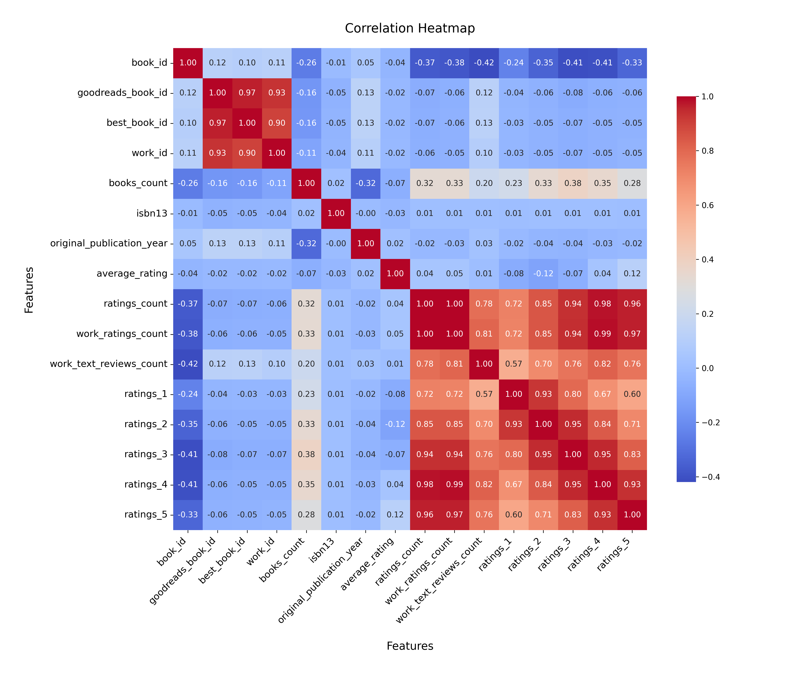

# Analysis Report

### Summary of the Goodreads Dataset

The dataset consists of 10,000 entries and 23 columns, capturing various attributes related to books listed on Goodreads. Key columns include book IDs, author information, publication years, ratings, and image URLs. The dataset is relatively comprehensive, but it does contain some missing values in critical fields such as ISBNs, original titles, and language codes.

#### Key Insights

1. **Missing Values**:
   - The `isbn` column has 700 missing values, while `isbn13` has 585 missing values. This could limit the ability to uniquely identify books, especially in merging with other datasets.
   - The `original_publication_year` has 21 missing values, which could affect analysis related to publication trends.
   - The `language_code` has 1,084 missing entries, indicating that many books do not have a specified language, which is crucial for user demographics and targeting.

2. **Authors and Popularity**:
   - The dataset features 4,664 unique authors, with Stephen King being the most frequently mentioned, appearing 60 times. This could indicate a potential focus area for marketing or thematic analyses.
   - The average rating of the books is approximately 4.00, suggesting that the majority of books are well-received by readers.

3. **Ratings Distribution**:
   - The `ratings_count` average is about 54,001, with a maximum of 4,780,653, indicating a significant skew in popularity among certain titles.
   - The distribution of ratings (1 to 5) shows a tendency towards higher ratings, with the average number of 5-star ratings being notably high (23,789 on average), suggesting a positive reception among readers.

4. **Publication Trends**:
   - The average original publication year is around 1982, with a range that spans from as early as 1750 to 2017. This indicates a mix of classic and contemporary titles.

5. **Language Diversity**:
   - The dataset includes books in at least 25 different languages, with English being the most common (appearing 6,341 times). The significant number of missing language codes might hinder accurate demographic analysis.

6. **Visual Representation**:
   - Charts illustrating the distribution of ratings, number of books per author, or publication trends over time could provide further insights into popular genres or successful authors.

### Recommendations

1. **Data Cleaning**:
   - Address the missing values in critical columns such as `isbn`, `original_title`, and `language_code`. Consider imputing missing values where possible or removing entries that lack essential information.

2. **Focus on Popular Authors**:
   - Given the prominence of certain authors like Stephen King, targeted marketing campaigns or promotions for their works could yield higher engagement and sales.

3. **Explore Rating Trends**:
   - Investigate the factors contributing to high ratings, such as genre, author reputation, or publication year. This could inform future publishing strategies or marketing approaches.

4. **Enhance Language Representation**:
   - Efforts should be made to improve the representation of language codes to facilitate better analysis of linguistic diversity in the dataset.

5. **Visual Analytics**:
   - Utilize visualizations to communicate trends and insights more effectively, particularly in understanding ratings distributions and the relationship between publication years and average ratings.

By implementing these recommendations, the dataset can be enhanced for more robust analyses, leading to better insights into reader preferences and trends within the book publishing industry.

