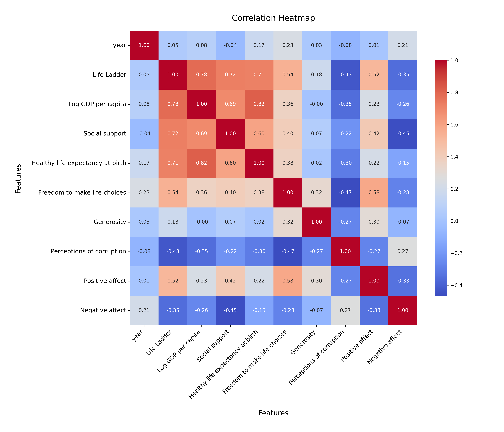

# Analysis Report

### Dataset Summary

The dataset `happiness.csv` consists of 2,363 rows and 11 columns, capturing various factors related to happiness across different countries and years. The key columns include:

- **Country name**: Name of the country.
- **Year**: The year of the recorded data.
- **Life Ladder**: A measure of subjective well-being, where higher values indicate greater happiness.
- **Log GDP per capita**: The logarithm of GDP per capita, reflecting economic performance.
- **Social Support**: A measure of the perceived support received from family and friends.
- **Healthy Life Expectancy at Birth**: An estimate of the average number of years a newborn is expected to live in good health.
- **Freedom to Make Life Choices**: A measure of the perceived freedom individuals have in making life choices.
- **Generosity**: A measure of individuals' donations and altruistic behaviors.
- **Perceptions of Corruption**: The extent to which corruption is perceived to occur in the country.
- **Positive Affect**: A measure of positive emotions experienced by individuals.
- **Negative Affect**: A measure of negative emotions experienced by individuals.

### Key Insights

1. **Missing Values**: The dataset has varying amounts of missing data across columns. Notably, 'Generosity' has the highest missing values (81), while 'Healthy life expectancy at birth' has 63. This could affect analyses involving these features.

2. **Life Ladder Analysis**: The mean Life Ladder score is approximately 5.48, with a standard deviation of about 1.13. This indicates a moderate level of happiness across the dataset. The minimum score is 1.281, which suggests that some countries experience very low levels of happiness.

3. **Economic Factors**: The mean Log GDP per capita is around 9.40 with a maximum value of 11.676, suggesting significant variation in economic conditions. Countries with higher GDP per capita typically report higher Life Ladder scores.

4. **Social Support**: The average score for Social Support is approximately 0.81, indicating that many individuals feel supported by their social circles, which is a crucial factor for overall happiness.

5. **Freedom and Corruption**: The mean score for Freedom to Make Life Choices is around 0.75, while Perceptions of Corruption average around 0.74. These metrics highlight the importance of personal freedom and low corruption levels in enhancing happiness.

6. **Affect Scores**: Positive Affect averages at 0.65 and Negative Affect at 0.27, suggesting that individuals generally experience more positive emotions than negative ones.

### Recommendations

1. **Address Missing Data**: It is crucial to handle missing values appropriately to ensure robust analysis. Techniques such as imputation or filtering out entries with excessive missing data should be considered.

2. **Focus on Economic Growth**: Countries with lower Life Ladder scores should be targeted for economic development initiatives. Strategies to increase GDP per capita could lead to improved happiness levels.

3. **Enhance Social Support Systems**: Governments and organizations should invest in community-building programs that strengthen social ties, as social support is closely linked to happiness.

4. **Promote Personal Freedom**: Policies that enhance individual freedoms and reduce bureaucratic constraints can help improve overall happiness.

5. **Combat Corruption**: Efforts to reduce corruption will likely lead to improved happiness outcomes. Transparency initiatives and anti-corruption campaigns should be prioritized.

6. **Further Research**: Additional analysis is needed to explore the relationships between the various factors influencing happiness, particularly focusing on longitudinal studies that assess changes over time.

### Conclusion

The `happiness.csv` dataset provides valuable insights into the factors affecting happiness across countries. By addressing missing data, focusing on economic growth, enhancing social support, promoting personal freedoms, and combating corruption, stakeholders can work towards improving overall happiness levels in various nations.

