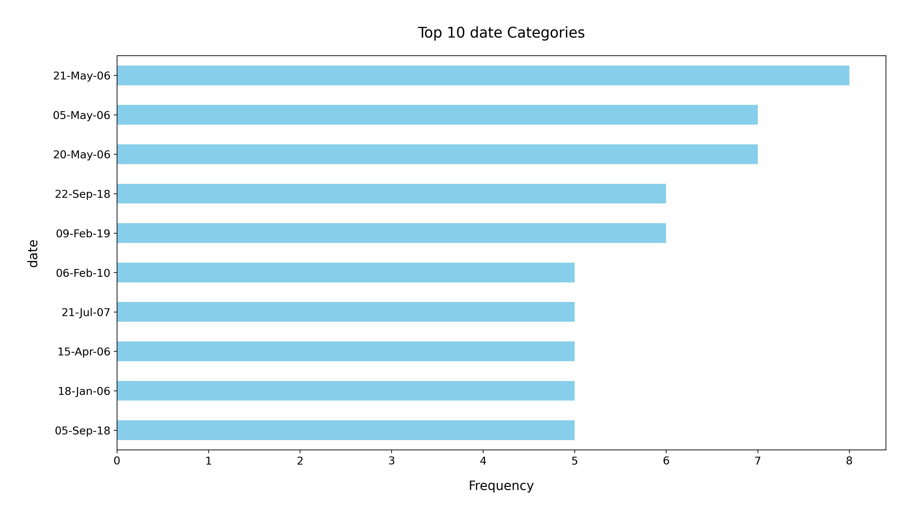

# Analysis Report

### Summary of the Dataset

The `media.csv` dataset consists of 2652 entries and 8 columns, providing insights into various media items. The columns include:

- **date**: The release or publication date of the media item.
- **language**: The language in which the media is produced.
- **type**: The type of media (e.g., movie, series).
- **title**: The title of the media item.
- **by**: The creator or contributor of the media.
- **overall**: An overall rating of the media item.
- **quality**: A quality rating of the media item.
- **repeatability**: A measure of how likely it is for the media to be enjoyed again.

#### Key Insights

1. **Missing Values**: 
   - The dataset has 99 missing values in the `date` column and 262 missing values in the `by` column. This indicates potential issues with the completeness of the data, particularly regarding the release dates and contributors.
   - The other columns do not have any missing values.

2. **Language Distribution**: 
   - The most common language in the dataset is English, appearing in 1306 entries, which constitutes approximately 49% of the dataset.
   - There are 11 unique languages represented, suggesting a diverse range of media.

3. **Media Type**: 
   - The dataset heavily favors movies, with 2211 entries categorized as such. This indicates a bias in the type of media present in the dataset.

4. **Ratings**: 
   - The average overall rating is approximately 3.05 (on a scale from 1 to 5), with a standard deviation of about 0.76, indicating a moderate level of satisfaction.
   - The average quality rating is slightly higher at 3.21, with a standard deviation of 0.80.
   - The repeatability rating averages at 1.49, suggesting that most media items are less likely to be re-watched or revisited.

5. **Most Frequent Titles and Contributors**:
   - The title "Kanda Naal Mudhal" appears most frequently (9 times), while "Kiefer Sutherland" is the most recurrent contributor (48 times). This highlights prominent media and contributors in the dataset.

#### Recommendations

1. **Data Cleaning**: Address the missing values in the `date` and `by` columns. This could involve either imputing missing values based on other available data or removing entries with significant missing information.

2. **Expand the Dataset**: To reduce the bias toward movies, consider acquiring more data related to other media types (e.g., TV shows, documentaries) to create a more balanced dataset.

3. **Analyze Ratings Further**: Conduct deeper analysis to understand what factors contribute to higher ratings. This could involve segmenting the data by language, type, or contributor to identify trends in ratings.

4. **Visualization**: Create visualizations such as histograms for ratings distributions, bar charts for language and type distributions, and time series plots for the release dates to better understand trends and patterns in the data.

5. **Investigate Repeatability**: The low repeatability rating suggests that media may not be engaging enough for repeat views. Analyzing the characteristics of highly-rated media could provide insights into how to improve engagement.

By addressing these recommendations, the dataset can be enhanced to yield more meaningful insights about media content and consumption patterns.

